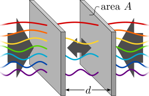

# CaLiForce

**CaLiForce** is a package designed for the precise calculation of the **Ca**simir-**Li**fshitz Force between two dielectric plates.
Utilizing Lifshitz' formula, this tool enables scientists and researchers to explore the fascinating quantum mechanical 
effects that manifest at microscopic separations. The Casimir-Lifshitz force, a pivotal phenomenon in quantum field theory, 
arises from the quantum fluctuations of the electromagnetic field in the vacuum between two materials. This force plays a 
crucial role in various systems such as micro- and nanoelectromechanical systems (MEMS and NEMS), colloidal suspensions and 
biology at the cell scale.

Our package offers a robust set of features, including:
* Calculation of the Casimir free energy, force, and force gradient per unit area, enabling detailed analysis of interactions at the nano-scale.
* Support for arbitrary temperatures, allowing for simulations under a wide range of conditions. 
* The ability to specify the dielectric response of each material involved, including the medium between the planes, providing flexibility for research across different materials. 
* Accommodation for up to three layers of coatings on each plane, each of arbitrary thickness, enabling the study of complex material systems.

<p align="center">
  
</p>

## Installation

In order to install CaLiForce, first navigate to package folder
```
cd path/to/CaLiForce
```
If you do not wish to install the package into your base python library, you may want to create a [virtual environment](https://docs.python.org/3/tutorial/venv.html) before installing the package. A virtual environment can be created with
```
python -m venv env
```
To activate the environment on Unix/MacOS, run:
```
source env/bin/activate
```
or on Windows, run:
```
env/Scripts/activate
```

Finally, install the package with the command
```
pip install .
```

## Usage

Based on Lifshitz formula, this package calculates the Casimir-Lifshitz interaction for laterally infinite plates.
The results can nevertheless be applied to finite plates when their separation is much smaller than their lateral 
dimension by multiplying the here obtained resul ts by their area A.

In the following the usage of the code is discussed. The given examples can be found amongst other examples as python scripts
in the `examples/` folder.

### Example 1 (two gold half spaces in vacuum)

As a first example, we calculate the Casimir energy and pressure between two gold half-spaces in vacuum at 300K and
separation of 1 micron.

To do so, we import the `system` class which contains all relevant parameters specifying the system of interest and
import the materials we want to use:
```
from CaLiForce.compute import system
from CaLiForce.materials import gold, vacuum
```
Notice that the imported material class for gold is described by a simple Drude model characterized by a angular plasma
frequency of 9eV/hbar and angular damping frequency of 35meV/hbar.

Next, we create an instance of the system of interest:
```
T = 300     # in K
d = 1.e-6   # in m
s = system(T, d, gold, gold, vacuum)
```
The system class takes the following arguments: temperature in K, separation in m, material object of left plate,
material object of right plate, material object of medium. How to specify coatings will be discussed in example 3.

To calculate the Casimir energy and the Casimir pressure, we call the class function `system.calcuate` for the system we
initialized with the keywords of the corresponding observables we want to calculate:
```
print(s.calculate('energy'))
print(s.calculate('pressure'))
```
which results in:
```
>>> -3.173382921719448e-10
>>> -0.0009832292489922454
```
The code prints the result for the Casimir free energy per unit area and the Casimir pressure in SI units.
We find -0.317nJ/m^2 and 0.983mPa, respectively. The negative sign of the pressure indicates that the force between the
plates is attractive.

### Example 2 (user-specified material)

We calculate the Casimir pressure between a gold halfspace and a halfspace made of a user-specified material.
The whole system is immersed in ethanol at 300K and the two plates are separated by 100nm.

Again, we import the `system` class and the material classes for `gold` and `enthanol`: 
```
from CaLiForce.compute import system
from CaLiForce.materials import gold, ethanol
```
We then define the user-specified material:
```
class user_material:
    def __init__(self):
        self.materialclass = 'dielectric'
    def epsilon(self, xi):
        wj = 1.911e15   # = 1.26 eV/hbar
        cj = 1.282      # dimensionless
        return 1. + cj * wj ** 2 / (wj ** 2 + xi ** 2)
u = user_material()
```
The material needs to define as a class (here called 'user_material') with the field `materialclass` and function
`epsilon`. The function `epsilon` represents the dielectric function for imaginary frequencies characterizing the
electromagnetic response of the user-specified material. The function argument `xi` represents the angular imaginary
frequency in units of rad/s. The field `materialclass` specifies how the dielectric function is extrapolated towards
zero frequency.


Here, 'dielectric' is chosen as the materialclass value which indicates that the dielectric function becomes a constant
as the imaginary frequency goes to zero. Other supported materialclasses are 'drude', which is used for the imported
class for gold, and 'plasma', which should be used by metals modeled by the dissipationless plasma model.

The function `epsilon` is implemented using a Lorentz model with a single oscillator and specified parameters.
Finally, an object of the just specified class needs to be created, which will be used to define the system:
```
T = 300         # in K
d = 100.e-9     # in m
s = system(T, d, gold, u, ethanol)
```
The Casimir pressure for the system is then calculated as:
```
print(s.calculate('pressure'))
```
which results in:
```
>>> 0.22099374769016233
```
We find a Casimir pressure of 0.221Pa. The positive sign of the pressure indicates that the force is repulsive here.

### Example 3 (coating)

We calculate the Casimir pressure between two gold halfspaces in vacuum at 300K, where one surfaces is coated with a
50nm of Teflon film. The plates are separated by a distance of one micron.

Again, we import the `system` class and the predefined materials `gold`, `teflon` and `vacuum`and define the system:
```
from CaLiForce.compute import system
from CaLiForce.materials import gold, teflon, vacuum

T = 300     # in K
d = 1.e-6   # in m
s = system(300, d, [teflon, gold], gold, vacuum, deltaL=[50.e-9])
```
The materials of the left plate are now specified by a list, where the first entry corresponds to the coating layer closest to the other plate and
the last entry corresponds to the substrate halfspace. 
The thickness of the coatings are specified in the list defining the optional parameter `deltaL` with the first entry defining the thickness of the layer closest to the other plate.

Coatings on the right plate can be defined in the same way with `deltaR` being the optional parameter specifying the thickness of the coatings.
The software supports up to three coating layers.

We can now calculate the Casimir pressure in the usual way:
```
print(s.calculate('pressure'))
```
which results in:
```
>>> -0.0008397921324708965
```
We find a attractive Casimir pressure of -0.840Pa. Notice that the Casimir pressure is slightly smaller than the one
obtained from example 1 due to the coating.